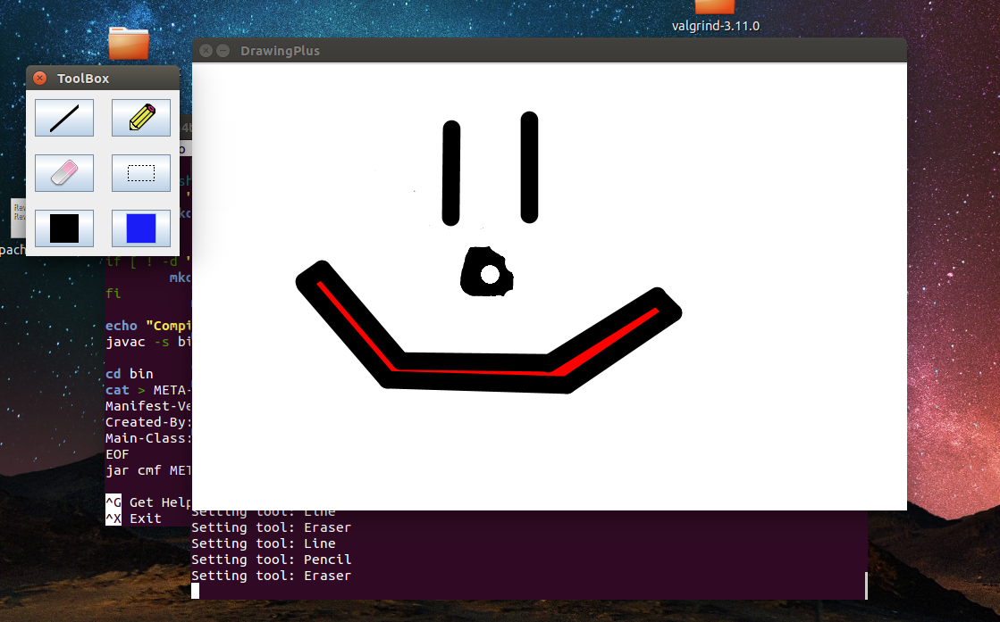

# DrawingPlus

 

### Description:

DrawingPlus is a project I worked on during highschool, it was a basic ms-paint
clone, with a basic pencil, line and eraser tools. I hoped to add selection, and
better saving of the drawn image. The most important thing I learned from this was
dynamic image buffers. The color picker preview boxes are colored based off of
what color you pick, drawn to an ImageBuffer and the button icon re-set.
